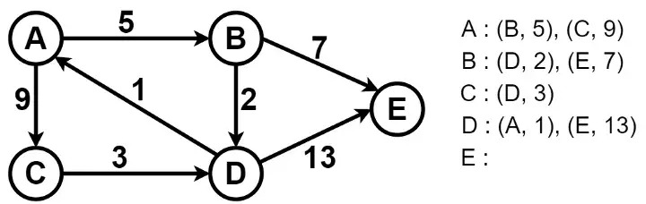

# genetic-graph
Finding the shortest path in a graph using a genetic algorithm (Selection by rank, single point crossover at random index).

## This is the graph used in this problem
 

## Mutation Function
The mutation function of this algorithm is a hybrid between insertion and inversion since the genotype is not binary.
it takes the node at the selected random index and the end node and finds a valid path between both. the result can look like inversion or insertion if both paths are similar.
